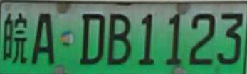
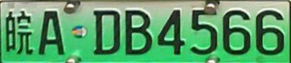

车牌号码识别，采用先分割后识别的方法进行

先使用分割网络对车牌进行分割，输入图像大小为 (512,512)，然后将分割得到的车牌输入到
识别网络中进行车牌号的识别,识别网络输入图像大小为(64,192)

使用的数据集车牌号的分布


### CTCLoss(连接时序分类损失函数)
__torch.nn.CTCLoss(blank=len(CHARS)-1, reduction='mean')__

__blank:__ __空白标签的label值__，__默认为0__，需要根据实际的标签定义进行设定；
在预测文本时，一般都是 __有一个空白字符的__，整个 __blank表示的是__ `空白字符在总字符集中的位置`。

__reduction:__ 处理output losses的方式，string类型，可选`none` 、 `mean` 及 `sum`，
`none`表示对output losses不做任何处理，
`mean` 则对output losses (即输出的整个batch_size的损失做操作) 取平均值处理，
`sum`则是对output losses求和处理，
默认为`mean` 。
```python
比如需要预测的字符集如下，其中'-'表示空白标签；

CHARS = ['京', '沪', '津', '渝', '冀', '晋', '蒙', '辽', '吉', '黑',
         '苏', '浙', '皖', '闽', '赣', '鲁', '豫', '鄂', '湘', '粤',
         '桂', '琼', '川', '贵', '云', '藏', '陕', '甘', '青', '宁',
         '新',
         '0', '1', '2', '3', '4', '5', '6', '7', '8', '9',
         'A', 'B', 'C', 'D', 'E', 'F', 'G', 'H', 'J', 'K',
         'L', 'M', 'N', 'P', 'Q', 'R', 'S', 'T', 'U', 'V',
         'W', 'X', 'Y', 'Z', 'I', 'O', '-'
         ]

因为空白标签所在的位置为 len(CHARS)-1，需要处理 CTCLoss output losses 的方式为 `mean`，
则需要按照如下方式初始化CTCLoss类：

ctc_loss = nn.CTCLoss(blank=len(CHARS)-1, reduction='mean')

湘E269JY  -->> 18, 45, 33, 37, 40, 49, 63 
冀PL3N67  -->> 4, 54, 51, 34, 53, 37, 38
川R67283F -->> 22, 56, 37, 38,33, 39, 34, 46
津AD68429 -->> 2, 41, 44, 37, 39, 35, 33, 40 
```

在车牌号码识别中, 若 `ctc=True`,则使用`torch.nn.CTCLoss()`损失函数，可以忽略由于蓝牌和新能源车牌造成的车牌号位数不一致的问题。
不需要在数据生成器中额外对车牌号进行对齐处理。
```python
def RecgTrain_fit(imagesize:tuple, bachsize=None, epoch=None, device=None, modelName=None)
    ctc = True # # False
    model = Recg(image_size=imagesize, ctc=ctc)
    ...
```
测试时对网络结果进行解码后处理
```python
def CTC_Decode(pred):
    _, pred = pred.max(2)
    pred = pred.transpose(1,0).contiguous().view(-1)
    char_list = []
    for i in range(len(pred)):
        if pred[i]!=0 and (not (i>0 and pred[i-1]==pred[i])):
            char_list.append(pred[i].item())
    
    char_list1 = [i-1 for i in char_list]
    char_list2 = [c - provincesNum for c in char_list[1:]]
    result = [char_list1[0]] + char_list2
    return "_".join([str(i) for i in result])
```


`loss = ctc_loss(log_probs, targets, input_lengths, target_lengths)`

log_probs : 模型输出结果，经过 `log_softmax` 函数处理， `(T, B, C)`, `T` 为序列的长度,`B` 为批处理大小,`C` 预测类别数.

targets : 所有标签合并后的结果， 维度为 `(s)`

input_lengths : 由 序列长度组成的 `B`个元素， [T]*B

target_lengths : 每个标签的长度


识别中使用 Sigmoid 函数效果和使用Softmax函数效果对比

### 车牌识别结果
车牌识别结果：(数据集问题导致省份识别结果较差)

 
input label :  0_0_3_1_24_27_26_25 绿牌

pred  label :  0_0_3_1_24_27_26_25 绿牌


 
input label :  0_0_3_1_24_31_27_29 绿牌

pred  label :  0_0_3_1_25_31_27_29 绿牌

 
input label :  0_0_3_1_25_25_26_27 绿牌

pred  label :  0_0_3_1_25_25_26_27 绿牌

 
input label :  0_0_3_1_25_26_26_30 绿牌

pred  label :  0_0_3_1_25_26_26_30 绿牌

 
input label :  0_0_3_1_28_29_30_30 绿牌

pred  label :  0_0_3_1_28_29_30_30 绿牌

 
input label :  0_0_3_1_28_31_31_31 绿牌

pred  label :  0_0_3_1_28_31_31_31 绿牌


CTC Loss Function

>https://github.com/meijieru/crnn.pytorch/blob/master/utils.py
>https://zhuanlan.zhihu.com/p/67415439
